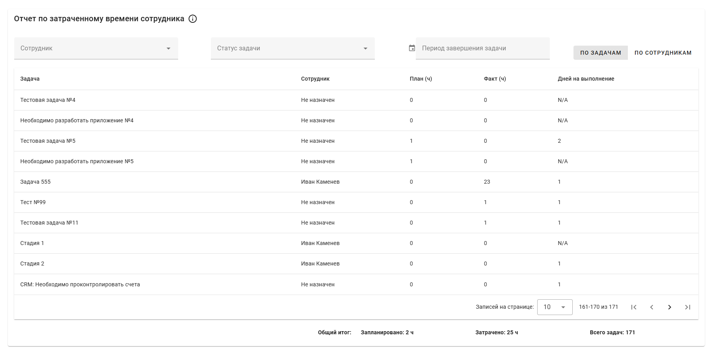

# Отчет по затраченному времени сотрудников в Bitrix24

Система для анализа и контроля трудозатрат сотрудников по задачам в Bitrix24.

### Два режима отображения отчета

- **По сотрудникам**: Сводный отчет, где каждая строка представляет одного сотрудника. Данные по задачам суммируются, что позволяет быстро оценить общую нагрузку и эффективность каждого члена команды.

- **По задачам**: Детальный отчет, где каждая строка представляет отдельную задачу. Этот режим позволяет анализировать трудозатраты на уровне конкретных задач.

### Ключевые показатели

- **Сотрудник**: Исполнитель задачи
- **Количество задач**: Общее число задач, выполненных сотрудником (в режиме "По сотрудникам")
- **Запланированное время**: Плановые трудозатраты в часах
- **Фактически затраченное время**: Реальные трудозатраты в часах
- **Дни на выполнение**: Количество дней от создания до завершения задачи

### Гибкая фильтрация данных

- **По сотруднику**: Выберите одного или нескольких сотрудников
- **По статусу задачи**: Фильтруйте задачи по их текущему статусу (Новая, Выполняется, Завершена и т.д.)
- **По периоду**: Укажите диапазон дат завершения задач для анализа

### Итоговые показатели

В нижней части отчета отображаются сводные данные:

- Общее запланированное время
- Общее затраченное время
- Общее количество задач

- **Задача:** Стандартные отчеты Bitrix24 не давали полной картины по трудозатратам. Руководителям было сложно анализировать, сколько времени тратится на проекты, сравнивать плановые и фактические часы и оценивать общую загрузку команды. Это приводило к трудностям в планировании и оценке рентабельности проектов.

- **Решение:** Разработано приложение с двумя режимами отчета (сводный по сотрудникам и детальный по задачам), которое позволяет в реальном времени анализировать трудозатраты. Гибкие фильтры по сотрудникам, периодам и статусам задач дают возможность получать срезы данных под любые управленческие запросы.

- **Результат:** Руководители получили инструмент для быстрого контроля за расходованием времени и эффективностью команды. Сравнение "план/факт" стало прозрачным, что помогло оптимизировать распределение ресурсов и улучшить точность планирования будущих проектов.

- **Стек:** Vue.js (Frontend), Node.js (Backend), Docker, Bitrix24 REST API.
- **Срок разработки:** 8 дней.
